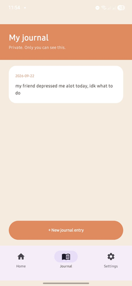
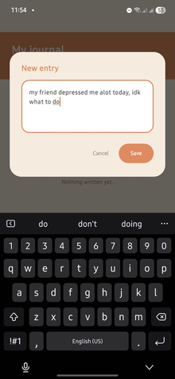
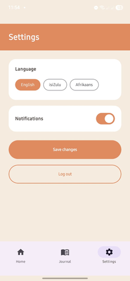

# MIRA🧡🫂

MIRA is an anonymous peer support app for Android. It gives people a safe space to share what they are going through, read that others feel the same way, and keep a private journal. The idea behind the app is one sentence that appears on the login screen: "You're not the only one."

## Video demonstration

Watch the full demonstration here: [LINK HERE]

## Purpose of the app

Many people struggle in silence with things like anxiety, skin problems, family conflict, gambling and substance abuse because they are scared of being judged. MIRA lets them post anonymously in a room that matches what they are going through. Other users can reply with a comment or tap "Me too" to show they relate. Because nobody sees a real name, people can be honest. The app also has a private journal that only the user can see.

## Screenshots

Login screen

Register screen

Rooms list, with a colour and icon for each room

A room feed with posts

Creating an anonymous post

A post with a comment and the Me too button

The private journal

Writing a new journal entry

Settings

## Features in this prototype

<<<<<<< HEAD
* Register and log in with an email and password. Passwords are hashed on the server before they are stored. ****
=======
* Register and log in with an email and password. Passwords are hashed on the server before they are stored.
* The login token is saved on the phone, so the user stays signed in until they log out.
* A settings screen where the user picks a preferred language and turns notifications on or off. The choices are saved to the server.
* Five rooms: Anxiety & Depression, Skin & Acne, Family Issues, Gambling and Substance Abuse.
* Anonymous posts. Every post and comment shows as Anonymous.
* Comments on posts.
* A "Me too" button on posts.
* A private journal where users can write and read their own entries.
* Errors such as no connection, empty fields or a server problem show a friendly message and do not crash the app.

## Planned for the final PoE

* Single sign on
* Offline mode with sync
* Real time push notifications
* Full multi language screens, including two South African languages (the language choice already saves in settings)

## Design considerations

We designed MIRA to feel calm and warm, because people using it may already be having a hard day.

* A warm colour palette from our Part 1 design document. Cream is the background and terracotta orange is the main colour on headers and buttons.
* Each room has its own accent colour and icon, so users can find the right space quickly.
* Rounded cards and buttons, the same layout on every screen, and large tap targets.
* Anonymity comes first. The app never shows a real name or email to other users.
* The journal is separate from the rooms so private thoughts never mix with public posts.

## How the app uses the REST API

The app talks to a REST API that we created and host on Render. The API stores its data in a MongoDB database.

Base address: https://mira-android.onrender.com/

Every request after login sends the user's token in an Authorization header as a Bearer token.

Endpoints the app uses:

* POST /register creates an account and returns a token
* POST /login checks the details and returns a token
* GET /settings and PUT /settings read and save the user's settings
* GET /rooms lists the rooms
* GET /rooms/:id/posts lists the posts in a room
* POST /posts creates a post in a room
* PUT /posts/:id/metoo adds a Me too to a post
* POST /posts/:id/comments adds a comment to a post
* GET /journal and POST /journal read and add private journal entries

## Technology used

* Kotlin and Jetpack Compose with Material 3 for the interface
* Retrofit and Gson to call the API and read the JSON
* Kotlin coroutines for background work
* JUnit for unit tests
* GitHub Actions for automatic builds and tests

## Project structure

The app code is in android/app/src/main/java/com/mira/app and is split into folders:

* data holds the token manager that saves the login token
* model holds the data classes that match the API's JSON
* network holds the Retrofit client and the API interface
* ui holds the screens, split into auth, rooms, feed, post, journal, settings and theme

## Logging

Failed requests are written to Logcat under the tag MIRA. Each message says which screen the problem happened in, which helped us find issues while connecting to the live server.

## Testing

Unit tests are in android/app/src/test. They check that the app reads the server's JSON correctly, including the IDs, the comment text and the journal text, and that each room gets the right accent colour. They run with the command ./gradlew testDebugUnitTest.

## GitHub and GitHub Actions

We used GitHub for version control. We committed and pushed regularly, and pulled with rebase so the whole team's changes stayed together.

Our workflow is in .github/workflows/android.yml and is called Android CI. It runs every time code is pushed to main, or a pull request is opened. It does the following:

1. Checks out the code
2. Sets up Java 17
3. Sets up Gradle
4. Builds the debug APK
5. Runs the unit tests
6. Uploads the APK so anyone can download it

This makes sure the app builds and the tests pass on a clean computer and not only on ours.

## How to run the app

1. Clone this repository.
2. Open the android folder in Android Studio.
3. Let Gradle sync, then run the app on a phone or emulator.
4. The server is on a free Render plan and can sleep. If the first request is slow, open https://mira-android.onrender.com in a browser, wait a minute, and try again.

## Team

* Mahlatse Mphelo built all of the Android screens and the design, connected the app to the API, added the logging and unit tests, and set up GitHub Actions.
* Isam Eltawil built the REST API and the database and deployed the server to Render.
* Lethabo Matsobane Boshomane tested the app on a real phone, took the screenshots and recorded the demonstration video.

## References

GitHub Marketplace (n.d.) Automated build Android app with GitHub Action. Available at: https://github.com/marketplace/actions/automated-build-android-app-with-github-action [Accessed 03 November 2025].

IMAD5112 (n.d.) build.yml. Available at: https://github.com/IMAD5112/Github-actions/blob/main/.github/workflows/build.yml [Accessed 03 November 2025].
